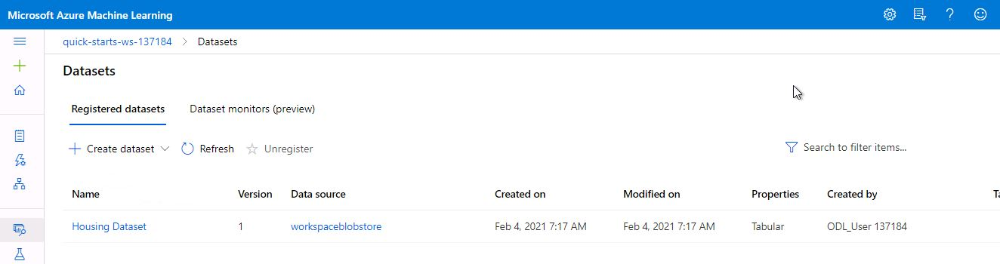

# Housing-Prices-with-Azure
In this project Boston Housing dataset has been used to practice a few concepts using Azure ML

1. Uploading dataset from local files and storing it in the datastore using Python SDK

2. Creating a regression model using hyperdrive

3. Primary metric is root mean squared error

### Registered Dataset

